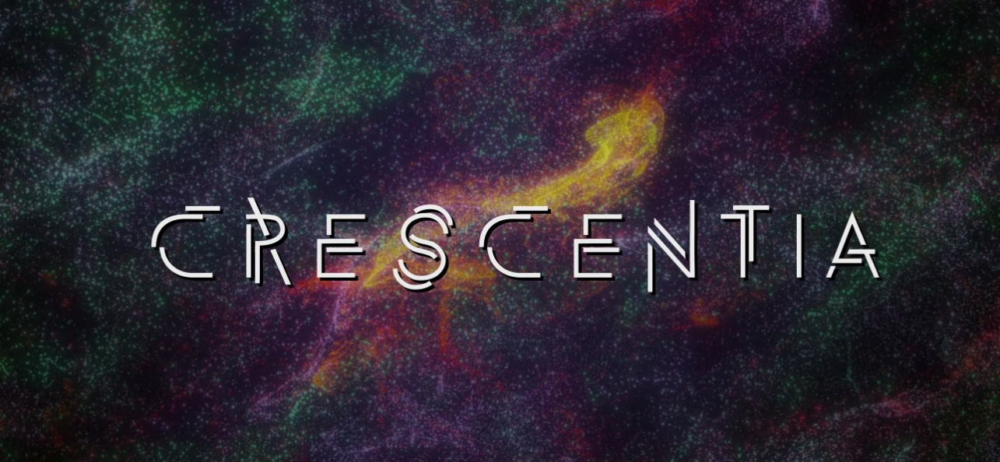
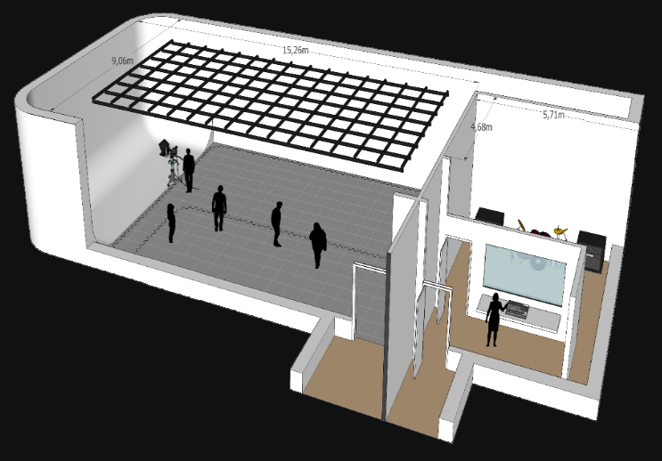

# Crescentia

## **Nom de l'exposition**
Cette exposition conçue par les élèves de la dernière session dans la technique d'intégration multimédia a été présentée par le programme TIM au collège Montmorency. Elle se nomme *Crescentia*. Elle a été créée en 2024.

###### Image promotionelle de *Crescentia*.

## **Lieu de mise en exposition**
Cette exposition a eu lieu à l'intérieur du collège Montmorency au 475 Boulevard de l'Avenir, Laval, Québec dans le petit et le grand studio.

###### Porte d'entrée du collège Montmorency.

## **Titre de l'œuvre**
L'œuvre porte le nom de *Crescentia*.

###### Photo de l'œuvre.

## **Titre des œuvres présentées dans l'exposition**
-*Rhizomatique*.
-*Effet-Papillon*.
-*Kigo*.
-*Sonalux*.
-*Canevas Cosmique*.

###### Photo des œuvres.

## **Type d'exposition**
Il s'agit d'une exposition intérieure, puisque celle-ci se fait uniquement dans un espace renfermé à l'intérieur d'un bâtiment pour bien voir la projection sur les écrans et bien voir l'éclairage. Cette œuvre est également temporaire. C'est à dire qu'elle ne reste qu'un certain temps dans le petit et grand studio du collège.

## **Description de l'exposition**
Crescentia, qui signifie « croissance » en latin, met de l'avant le concept d'évolution qui apparaît sous plusieurs facettes, que ce soit de manière organique, environnementale, ou encore psychologique. C'est aussi le nom de l'exposition finale des étudiants en techniques d'intégration multimédia du Collège Montmorency dont les œuvres explorent ce concept de plusieurs manières. Ce sont des créations en perpétuel mouvement, qui évoluent et se transforment au gré des actions des visiteurs.
###### Source : [tim-montmorency.com](https://tim-montmorency.com/2024/)

###### Vue d'ensemble de l'exposition.

## **Description de l'œuvre *Rhizomatique***
Rhizomatique est une oeuvre intéractive qui relie l'humain et le temps. De nos jours, le temps controle notre vie, on est souvent occupé et la vie va trop vite. Le temps est un fil qui ralonge selon différentes temporalités, actions ou événements dans la vie. Dans notre projet, en appuyant sur la toile l'interacteur naviguera dans le cerveau pour y découvrir ses souvenirs, qui vont par la suite être révellés sur les projections immersives. Lorsque l'intéraction prend fin, la projection sur les murs va reprendre son état initale jusqu'à la prochaine intéraction. L’œuvre consiste à insiter l'interacteur à vouloir oublier le temps qui passe et de retourner dans le passé d'une personne inconnu. L'oeuvre est divisé en deux espaces qui sont liés : la toile et les projections immersives. La toile va servir de communication entre l'interacteur et les souvenirs. La toile va aussi contrôler la clarté des souvenirs qui vont être représentés en particules. Plus qu'il y aura de l'intéraction avec la toile plus les souvenirs vont être clairs. La toile, qui représente le cerveau, aura une projection qui représentera les fluides et l'allure rhizomatique du cerveau.
###### Source : [tim-montmorency.com](https://tim-montmorency.com/2024/projets/Rhizomatique/docs/web/index.html)

###### Photo de l'œuvre *Rhizomatique*.

## **Description de l'œuvre *Effet-Papillon***
Une installation interactive immersive qui explore le cycle de vie d'un pommier tout en mettant en lumière l'effet papillon à travers des éléments électroniques. Les visiteurs sont invités à participer à une expérience sensorielle et éducative qui dévoile les différentes étapes, de la graine à la pomme, tout en soulignant la notion complexe de l'effet papillon. La maturation du fruit est une phase clé de l'installation, où les visiteurs découvrent les conséquences finales de leurs actions. La pomme résultante devient le point focal, représentant les retombées de choix apparemment minuscules sur un système complexe.
###### Source : [tim-montmorency.com](https://tim-montmorency.com/2024/projets/Effet-Papillon/docs/web/index.html)

###### Photo de l'œuvre *Effet-Papillon*.

## **Description de l'œuvre *Kigo***
Un jeu interactif oû le joueur doit éviter des obstacles dans un univers inspiré du style visuel néon rétro, dans lequel l'esthétique changera pour s'associer aux quatres saisons.
###### Source : [tim-montmorency.com](https://tim-montmorency.com/2024/projets/Kigo/docs/web/index.html)

###### Photo de l'œuvre *Kigo*.

## **Description de l'œuvre *Sonalux***
Sonalux est une installation qui dépasse les limites du réel pour proposer un monde d'art génératif où la notion du temps est repensé dans une boucle laissant place à un voyage astral collectif. L'interacteur se voit projeter dans un espace sans contraintes où il en devient le maître par la maîtrise des pièces d'instruments qui se trouvent sur le podium.
###### Source : [tim-montmorency.com](https://tim-montmorency.com/2024/projets/Sonalux/docs/web/index.html)

###### Photo de l'œuvre *Sonalux*.

## **Description de l'œuvre *Canevas Cosmique***
Sonalux est une installation qui dépasse les limites du réel pour proposer un monde d'art génératif où la notion du temps est repensé dans une boucle laissant place à un voyage astral collectif. L'interacteur se voit projeter dans un espace sans contraintes où il en devient le maître par la maîtrise des pièces d'instruments qui se trouvent sur le podium.
###### Source : [tim-montmorency.com](https://tim-montmorency.com/2024/projets/Canevas-Cosmique/docs/web/index.html)

###### Photo de l'œuvre *Canevas Cosmique*.

## **Type d'installation**
Cette exposition est une installation immersive. C'est à dire qu'elle plonge le public dans un monde immersif, dans le monde de l'œuvre en question. Le public séjourne dans l'œuvre et vit l'expérience.

## **Mise en espace de l'exposition**
Quatre œuvres multimédias dans le grand studio du collège et une dans le petit studio. Ceux dans le grand studio sont dans une salle blanche plutôt remplis par le matériel de chaque œuvre et chacune est dans un coin de la pièce, vis-à-vis l'une à l'autre. Celle dans le petit studio est dans une salle noir moins remplis cette fois puisqu'elle est seul, mais elle prend toute la pièce comme espace. Chacune des œuvres utilises des écrans pour afficher leurs résultats. Certains matériels comme les projecteurs sont accrochés au plafond.

###### Croquis du grand et petit studio.

## **Mise en espace de l'œuvre *Rhizomatique***
On voit plein de vidéo flou superposer une par dessus l'autre sur le murs du fond du studio. Il y a également une installation qui est intéractive au millieu en avant des vidéos. Des hauts-parleurs sont accrochés au plafond.

###### Mise en espace de *Rhizomatique*.

## **Mise en espace de l'œuvre *Effet-Papillon***
On voit un arbre électronique intérctif au milieu de la pièce avec 8 écrans dessus. Chaque murs est projeté par des lumières et des projecteurs accrochées au plafonds. Des hauts-parleurs sont également accrochés au plafond.

###### Mise en espace de *Effet-Papillon*.

## **Mise en espace de l'œuvre *Kigo***
On voit un capteur kinect en dessous d'un grand écran ou l'œuvre intéractive sera affiché. Il y à aussi un terrain prédéterminé pour l'utilisateur là ou il devra se placer pour commencer le début de la partie. Des hauts-parleurs et projecteurs sont sur chaque côtés de l'écran

###### Mise en espace de *Kigo*.

## **Mise en espace de l'œuvre *Sonalux***
3 murs sont présents avec chacun une projection de l'œuvre qui est synchonisé sur chaque écrans. Un podium intéractif est au milieu des 3 murs pour contrôler leurs projection. Des hauts-parleurs et projecteurs sont accrochés au plafond.

###### Mise en espace de *Sonalux*.

## **Mise en espace de l'œuvre *Canevas Cosmique***
Un projecteur affiche sur le murs d'en face l'œuvre en question. Une table intéractive est présente en face du murs qui nous permet de modifier le résultat. Des hauts-parleurs sont accrochés au plafond de chaque côtés de l'écran.

###### Mise en espace de *Canevas Cosmique*.

## **Composantes et techniques**
Installation vidéographique, avec son multi-canaux et lumières. Hauts-parleurs et projecteurs.

###### Photo de composantes.

## **Éléments nécessaires à la mise en exposition**
Haut-parleurs accrochés sur des crochets au plafond ou sur les dispositifs nécessaires pour écouter le son, plusieurs projecteurs également accrochés sur des crochets au plafond pour montrer chacune des œuvres présentées par les différentes équipes, lumières respectives sur des crochets installés au plafond pour chacune des œuvres, branchements électriques qui sont visible mais qui ne sont pas dans le chemin pour faire fonctionner le tout, tapis de mousse au sol.

###### Les éléments nécessaires à la mise en exposition.

## **Expérience vécue**
Belle expérience intéressante et immersive avec des explications claires de l’œuvre pour savoir son but. L'intéracteur joue un rôle important dans chacune des œuvres. Chaque expositions fonctionnent différement l'une de l'autre ce qui fait une belle variété de découverte a faire.

## **Ce qui m'a plu et m'a donné des idées**
J'ai aimé la variété des œuvres car cette fois-ci au lieu d'avoir une seul œuvre, il y en a cinq donc une belle variété. Chaque expositions est différentes donc chaque expérience vécu avec chacune des œuvres va étre différente et unique de la précédente dont j'ai apprécié cela. Ils ont tous un concept intéressant.

## **Aspect que je ne souhaite pas retenir pour mes propres créations ou que je ferai autrement**
Je ferais peut-être certaines des composantes et techniques différemment car les branchements sont visibles pour la plupart des œuvres ce qui la rend unpeu moins professionel.
