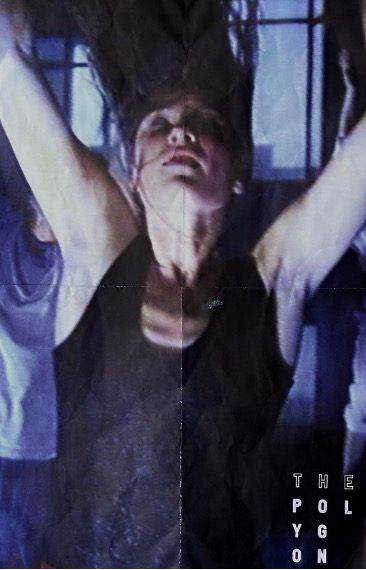
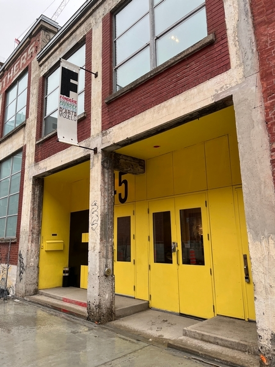
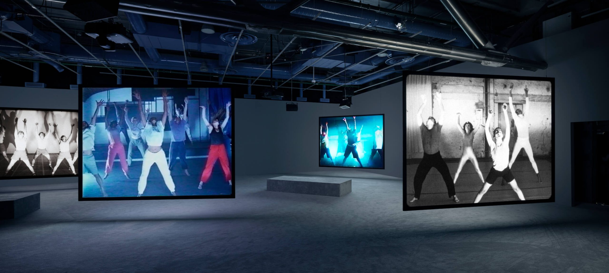
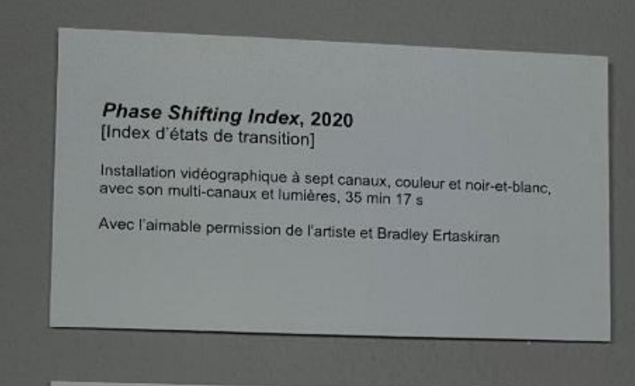

# Phase Shifting Index

## **Nom de l'exposition**
Cette exposition conçu par Jeremy Shaw a été présenté par le musée d'art contemporain de Montréal. Elle porte le nom de *Phase Shifting Index*. Elle a été créée en 2020.

###### Image promotionelle de *Phase Shifting Index*

## **Lieu de mise en exposition**
Cette exposition a eu lieu à l'intérieur de la Fonderie Darling au 745 Rue Ottawa à Montréal, Québec.

###### Porte d'entrée de la Fonderie Darling

## **Titre de l'oeuvre**
L'oeuvre porte le nom de *Phase Shifting Index*.

###### Photo de l'oeuvre 

## **Information sur l'artiste**
Jeremy Shaw, né en 1977 à Noth Vancouver, est connu pour son utilisation de différentes techniques pour explorer les états seconds ainsi que les pratiques culturelles et scientifiques qui cherchent à tracer les expériences transcendantales. Il utilise souvent des stratégies tirées du cinéma-vérité, de l’art conceptuel, des vidéoclips et de la recherche scientifique afin de montrer un espace postdocumentaire où une variété de systèmes de croyances et de narrations se voient. Il a présenté des expositions individuelles au Centre Pompidou à Paris, au MoMA PS1 à New York, au Schinkel Pavillon à Berlin, et au MOCA à Toronto. Il a également participé à des expositions internationales telles que la 57e Biennale de Venise et Manifesta 11, à Zurich. Ses œuvres figurent dans plusieurs collections publiques à travers le monde, notamment celles du Museum of Modern Art de New York, du Centre Pompidou à Paris, de la Tate Modern à Londres, du Musée des beaux-arts du Canada à Ottawa, et de la Sammlung zeitgenössische Kunst des Bundesrepublik en Allemagne.
###### Source : [macm.com](https://macm.org/expositions/jeremy-shaw/)

###### Image de l'artiste Jeremy Shaw

## **Type d'exposition**
Il sagit d'une exposition intérieur, puisque celle-ci se fait uniquement dans un espace renfermé a l'intérieur d'un bâtiment pour bien voir la projection sur les écrans et l'éclairage. Cette oeuvre est également ittinérante. C'est à dire qu'elle voyage a plusieurs endroits dans le monde, comme à Paris, en Allemagne, au Canada, etc...

## **Description de l'oeuvre**
Phase Shifting Index représente sept groupes autonomes engagés dans des systèmes de croyance incarnés et basés sur le mouvement qui aspirent à induire des réalités parallèles. Utilisant divers médias démodés du XXe siècle, des années 1960 aux années 1990, Shaw présente ce qui semble être des séquences documentaires comme un futur lointain, créant une dissonance cognitive dans la relation du spectateur avec un sentiment de lieu et de temps. La tenue vestimentaire, le style et la chorégraphie des sujets suggèrent des images historiques trouvées des années 1960 aux années 1990. À travers des variations de danse moderne, de popping et de verrouillage, de sauts, de skanking hardcore et d'exercices de confiance, ils explorent les potentiels de modification physique de la réalité.
###### Source : [thepolygon.ca](https://thepolygon.ca/exhibition/jeremy-shaw-phase-shifting-index/)

## **Type d'installation**
Cette exposition est une installation immersive. C'est à dire qu'elle plonge le publique dans un monde immersif, dans le monde de l'oeuvre en question. Le publique séjourne dans l'oeuvre et vit l'expérience.

## **Mise en espace**
Sept écrans asser gros accrochées au plafond située sur chaque côté de la pièce accompagnée de banc pour s’assir. Les écrans sont descendu jusqu'au niveau des yeux des spectateurs. Il y a pas mal d’espace dans la pièce pour bouger puisque la majorité du matériel est accroché au plafond. Salle blanche plutôt vide appart pour les écrans et les bancs. Les écrans sont égalements accompagnées d'hauts-parleurs accrochées au plafond et positionner de manière à ce que le son est projeté sur le banc en face de l'écran.

## **Composantes et techniques**
Installation vidéographique à sept canaux, couleurs en noir et blanc, avec son multi-canaux et lumières. Durées de 35 minutes et 17 seconds. Il y a également une salle de son a l'intérieur pour contrôler d'où le son vient (haut parleur des écrans ou hauts-parleurs a fréquence basse).

## **Éléments nécessaires à la mise en exposition**
Banc pour s’assir, haut-parleurs accrochés sur crochet au plafond pour écouter le son, sept écrans également accrochée sur crochet au plafond pour montrer les sept pièces, lumières un peu partout sur crochet installer au plafond pour les jeux de lumières dans la salle, branchements électriques bien caché qui ne sont pas dans le chemin pour faire fonctionner le tout, tapis anti bruit au sol et au murs. Sept projecteurs pour diffuser les sept films séparément sur leurs écrans respectifs.

## **Expérience vécue**
Belle expérience unique, intéressante et immersive avec un bon personnel informé et avec des explications claires de l’œuvre pour savoir sont but. Le spectateur fait partit de l'oeuvre. L'exposition nous trompe en nous faisant croire que c'est seulement une diffusion de sept vidéos mais nous surprend vers la fin.

## **Ce qui m'a plu et m'a donné des idées**
J’ai aimé comment l’œuvre s’est terminé car c’était une fin inattendue qui m’a pris par surprise. Voir tous les films jouer en même temps puis après se transformer en films distordue pour ensuite revenir au calme avec un fond d’un univers multi couleur m'a impressionné. J’ai aussi aimé le concept de l’œuvre en général, qui était d’expérimenter avec une drogue les effets hallucinogènes révélateurs et thérapeutiques qu’elle a sur des volontaires et de voir par la suite ce qu’ils font en les enregistrant, c’était intéressant à voir. Cela m’a donné des idées pour des œuvres inattendue de ce genre aussi.

## **Aspect que je ne souhaite pas retenir pour mes propres créations ou que je ferai autrement**
Je ferais peut-être la mise en espace différemment car la salle était plutôt vide et ennuyante, mais je comprends que c’était pour mettre le focus plus sur les vidéos que la salle en soit. Je ferais une salle avec un décors plus intéressant à voir qui a quand même un lien avec l’œuvre de Jeremy Shaw.
