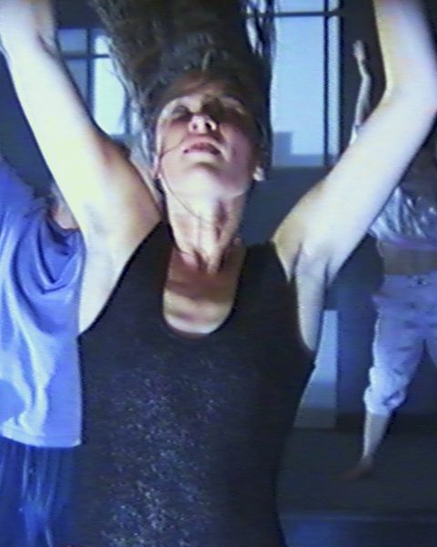
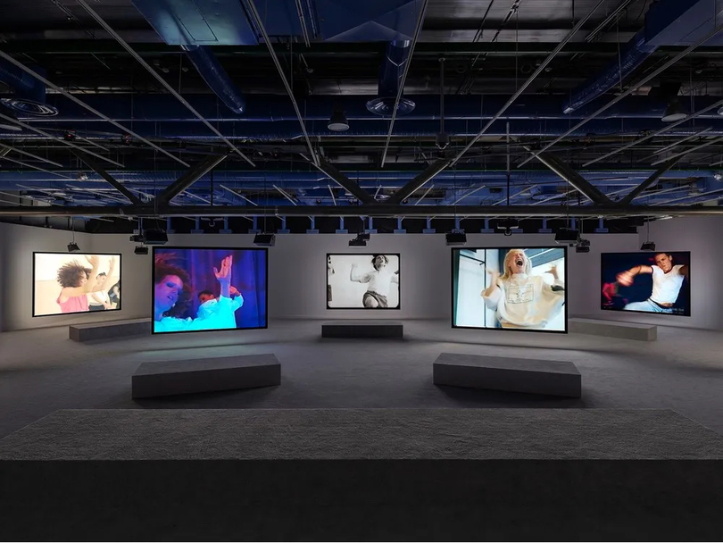
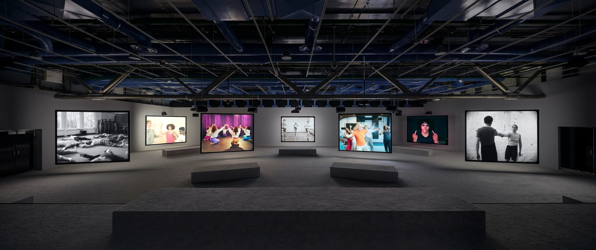
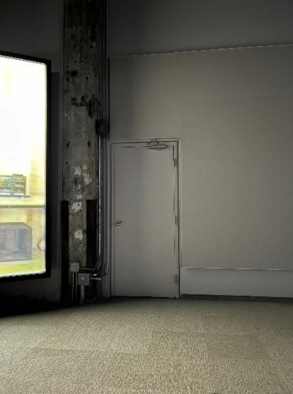
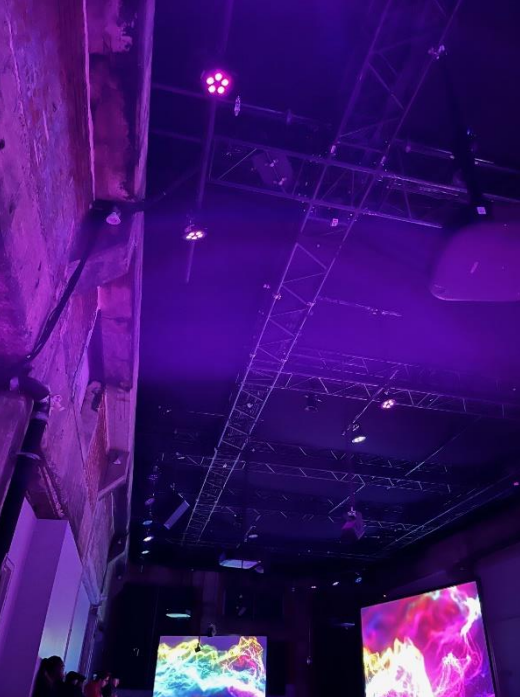
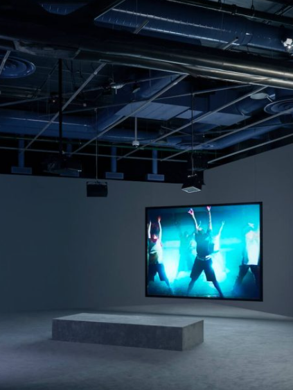

# Phase Shifting Index

## **Nom de l'exposition**
Cette exposition conçue par Jeremy Shaw a été présentée par le musée d'art contemporain de Montréal. Elle se nomme *Phase Shifting Index*. Elle a été créée en 2020.

###### Image promotionelle de *Phase Shifting Index*.

## **Lieu de mise en exposition**
Cette exposition a eu lieu à l'intérieur de la Fonderie Darling au 745 Rue Ottawa à Montréal, Québec.

###### Porte d'entrée de la Fonderie Darling.

## **Titre de l'œuvre**
L'œuvre porte le nom de *Phase Shifting Index*.

###### Photo de l'œuvre.

## **Information sur l'artiste**
Jeremy Shaw, né en 1977 à Noth Vancouver, est connu pour son utilisation de différentes techniques pour explorer les états seconds ainsi que les pratiques culturelles et scientifiques qui cherchent à tracer les expériences transcendantales. Il utilise souvent des stratégies tirées du cinéma-vérité, de l’art conceptuel, des vidéoclips et de la recherche scientifique afin de montrer un espace postdocumentaire où une variété de systèmes de croyances et de narrations se voient. Il a présenté des expositions individuelles au Centre Pompidou à Paris, au MoMA PS1 à New York, au Schinkel Pavillon à Berlin, et au MOCA à Toronto. Il a également participé à des expositions internationales telles que la 57e Biennale de Venise et Manifesta 11, à Zurich. Ses œuvres figurent dans plusieurs collections publiques à travers le monde, notamment celles du Museum of Modern Art de New York, du Centre Pompidou à Paris, de la Tate Modern à Londres, du Musée des beaux-arts du Canada à Ottawa, et de la Sammlung zeitgenössische Kunst des Bundesrepublik en Allemagne.
###### Source : [macm.com](https://macm.org/expositions/jeremy-shaw/)

###### Image de l'artiste Jeremy Shaw.

## **Type d'exposition**
Il s'agit d'une exposition intérieure, puisque celle-ci se fait uniquement dans un espace renfermé a l'intérieur d'un bâtiment pour bien voir la projection sur les écrans et l'éclairage. Cette œuvre est également ittinérante. C'est à dire qu'elle voyage a plusieurs endroits dans le monde, comme à Paris, en Allemagne, au Canada, etc...

## **Description de l'œuvre**
Phase Shifting Index représente sept groupes autonomes engagés dans des systèmes de croyance incarnés et basés sur le mouvement qui aspirent à induire des réalités parallèles. Utilisant divers médias démodés du XXe siècle, des années 1960 aux années 1990, Shaw présente ce qui semble être des séquences documentaires comme un futur lointain, créant une dissonance cognitive dans la relation du spectateur avec un sentiment de lieu et de temps. La tenue vestimentaire, le style et la chorégraphie des sujets suggèrent des images historiques trouvées des années 1960 aux années 1990. À travers des variations de danse moderne, de popping et de verrouillage, de sauts, de skanking hardcore et d'exercices de confiance, ils explorent les potentiels de modification physique de la réalité.
###### Source : [thepolygon.ca](https://thepolygon.ca/exhibition/jeremy-shaw-phase-shifting-index/)

###### Photo du cartel d'information sur l'œuvre.

## **Type d'installation**
Cette exposition est une installation immersive. C'est à dire qu'elle plonge le public dans un monde immersif, dans le monde de l'œuvre en question. Le public séjourne dans l'œuvre et vit l'expérience.

## **Mise en espace**
Sept écrans asser grands accrochés au plafond situés de chaque côté de la pièce accompagnée de bancs pour s’asseoir. Les écrans sont descendus jusqu'au niveau des yeux des spectateurs. Il y a beaucoup d’espace dans la pièce pour bouger puisque la majorité du matériel est accroché au plafond. Salle blanche plutôt vide à part pour les écrans et les bancs. Les écrans sont également accompagnés d'haut-parleurs accrochées au plafond et positionnés de manière à ce que le son soit projeté sur le banc en face de l'écran.

###### Photo du croquis de la pièce.

## **Composantes et techniques**
Installation vidéographique à sept canaux, couleurs en noir et blanc, avec son multi-canaux et lumières. Durées de 35 minutes et 17 seconds. Il y a également une salle de son à l'intérieur pour contrôler d'où le son vient (haut-parleurs des écrans ou haut-parleurs à fréquence basse).

###### Photo de la porte de la salle de son.

## **Éléments nécessaires à la mise en exposition**
Banc pour s’asseoir, haut-parleurs accrochés sur des crochets au plafond pour écouter le son, sept écrans également accrochés sur des crochets au plafond pour montrer les sept pièces, lumières un peu partout sur des crochets installés au plafond pour les jeux de lumières dans la salle, branchements électriques bien cachés qui ne sont pas dans le chemin pour faire fonctionner le tout, tapis anti bruit au sol et aux murs. Sept projecteurs pour diffuser les sept films séparément sur leurs écrans respectifs.

###### Les éléments nécessaires à la mise en exposition.

## **Expérience vécue**
Belle expérience unique, intéressante et immersive avec un bon personnel informé et avec des explications claires de l’œuvre pour savoir son but. Le spectateur fait partie de l'œuvre. L'exposition nous trompe en nous faisant croire que c'est seulement une diffusion de sept vidéos mais nous surprend vers la fin.

## **Ce qui m'a plu et m'a donné des idées**
J’ai aimé comment l’œuvre s’est terminée car c’était une fin inattendue qui m’a pris par surprise. Voir tous les films jouer en même temps puis après se transformer en films distordus pour ensuite revenir au calme avec un fond d’un univers multicolore m'a impressionné. J’ai aussi aimé le concept de l’œuvre en général, qui était d’expérimenter avec une drogue les effets hallucinogènes révélateurs et thérapeutiques qu’elle a sur des volontaires et de voir par la suite ce qu’ils font en les enregistrant. C’était intéressant à voir. Cela m’a donné des idées pour des œuvres inattendues de ce genre aussi.

## **Aspect que je ne souhaite pas retenir pour mes propres créations ou que je ferai autrement**
Je ferais peut-être la mise en espace différemment car la salle était plutôt vide et ennuyante, mais je comprends que c’était pour mettre le focus plus sur les vidéos que la salle en soit. Je ferais une salle avec un décor plus intéressant à voir, tout en conservant un lien avec l’œuvre de Jeremy Shaw.
