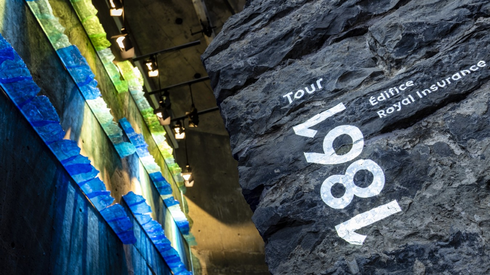
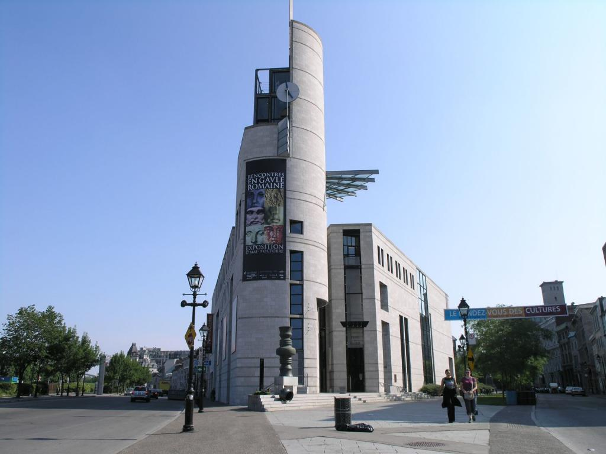
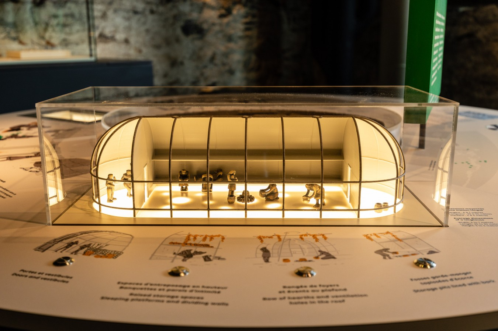
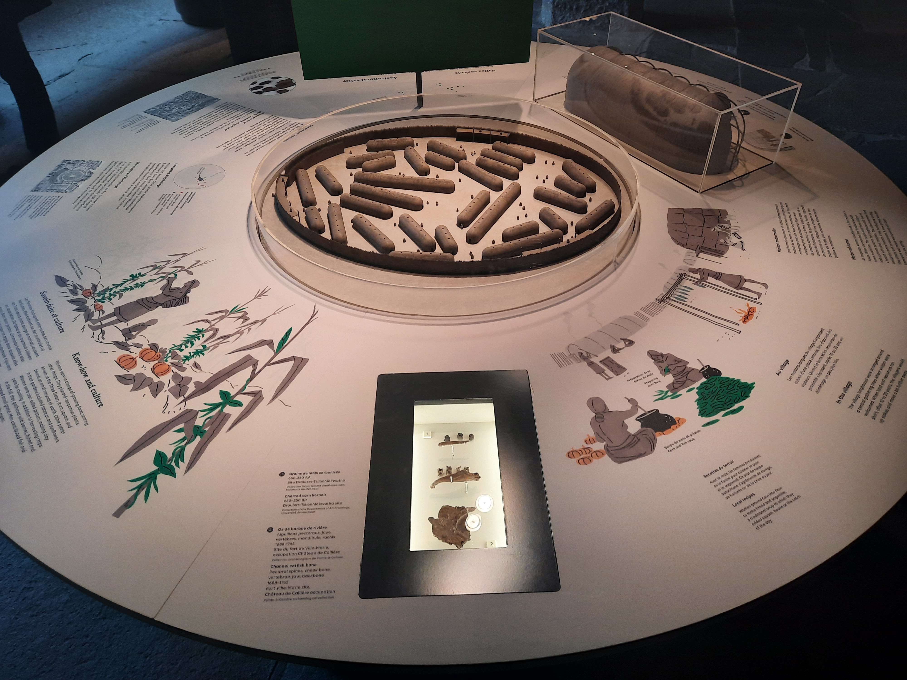
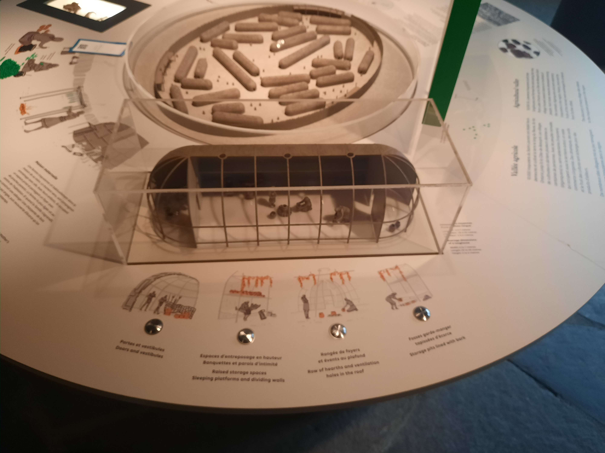
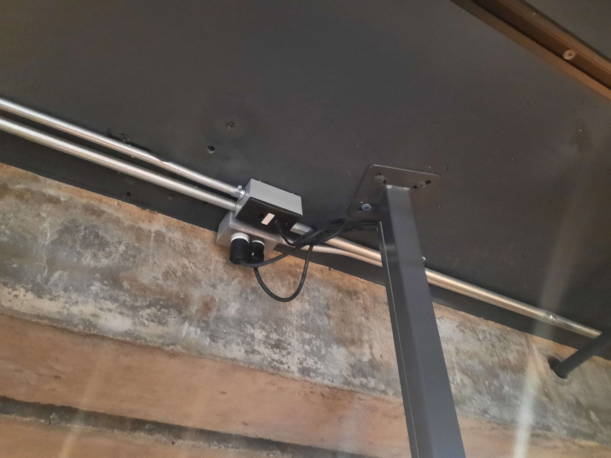
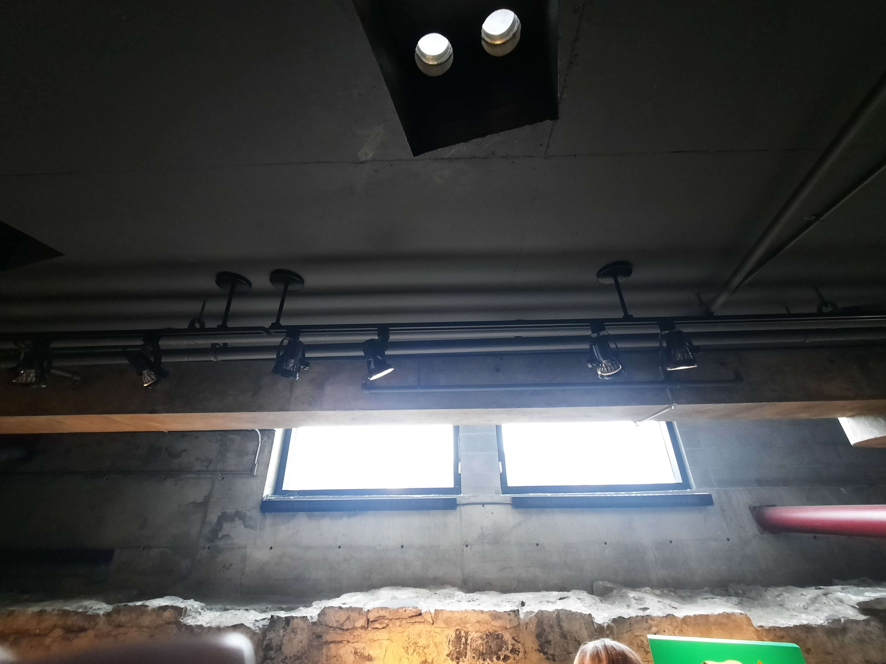

# Montréal au cœur des échanges

## **Nom de l'exposition**
Cette exposition a été conçu par le Musée de l'Archéologie et de l'Histoire de Montréal. Elle se nomme *Montréal au cœur des échanges*. Elle a été créée en 2021.

###### Image promotionelle de *Montréal au cœur des échanges*.
###### Source : [pacmusee.qc.ca](https://pacmusee.qc.ca/fr/expositions/detail/montreal-au-coeur-des-echanges/)

## **Lieu de mise en exposition**
Cette exposition a eu lieu à l'intérieur du Musée de l'Archéologie et de l'Histoire de Pointe-à-Callière au 350, place Royale, angle de la Commune au Vieux-Montréal, Québec.

###### Porte d'entrée du Musée de l'Archéologie et de l'Histoire.

## **Titre de l'œuvre**
L'œuvre que j'ai chosit porte le nom de *Maison Longue*.

###### Photo de l'œuvre.
###### Source : [pacmusee.qc.ca](https://pacmusee.qc.ca/fr/expositions/detail/montreal-au-coeur-des-echanges/)

## **Type d'exposition**
Il s'agit d'une exposition intérieure, puisque celle-ci se fait uniquement dans un espace renfermé à l'intérieur d'un bâtiment pour bien voir la projection sur les écrans et bien voir l'éclairage ainsi que les divers œuvres. Cette exposition est également permanente. C'est-à-dire qu'elle ne change jamais d'endroit, elle ne voyage pas ailleurs qu'au Musée de l'Histoire de Pointe-à-Callière.

## **Description de Montréal au cœur des échanges**
L’aventure Montréal au cœur des échanges débute sous l’Éperon, le bâtiment phare de Pointe-à-Callière. À travers le site archéologique, parmi lequel se trouvent notamment les fondations de l’édifice Royal Insurance (1861-1951), se raconte l’histoire de Montréal depuis la halte fréquentée par les chasseurs-cueilleurs il y a 4 500 ans, jusqu’au développement du Vieux-Montréal urbain que nous connaissons aujourd’hui. Ce site unique en Amérique du Nord cumule les traces de passages et de rencontres entre plusieurs peuples autochtones ou venus d’Europe. Les nombreux artéfacts, écofacts et vestiges architecturaux retrouvés lors de fouilles archéologiques témoignent de l’évolution de ce site. Le parcours archéologique est ponctué d’œuvres d’art autochtones contemporaines, d’installations artistiques et d'aménagements numériques et interactifs qui accompagnent le visiteur dans ses découvertes.
###### Source : [pacmusee.qc.ca](https://pacmusee.qc.ca/fr/expositions/detail/collecteur-de-memoires/)

## **Description de l'œuvre choisit**
Une œuvre qui nous permet de s'informer sur l'histoire du Vieux-Montréal. Il y a un modèle d'une maison longue. On peut s'informer sur celle-ci avec les boutons interactifs qu'ont peut appuyer. Lors de l'appuie d'un bouton, la partie de la maison longue liée à ce bouton s'illumine et nous permet d'en savoir plus sur son utilitée. 

## **Type d'installation**
Cette exposition est une installation intéractive. C'est à dire qu'elle permet au public d'intéragir avec, d'expérimenter avec ses fonctions.

## **Mise en espace**
Petite table ronde avec des informations sur l'histoire du Vieux-Montréal et un petit modèle d'une maison longue. La table est positionnée au milieu de sa pièce respective, ce qui permet au visiteur de ne pas la manquer. Il y a beaucoup d'espace pour marcher autour d'elle, ce qui rend l'expérience agréable.

###### Photo de la vue d'ensemble de la table.

## **Composantes et techniques**
Lumières cachées à l'intérieur de l'œuvre et éteinte de sorte que lorsque le visiteur appuie sur l'un des boutons, la lumière liée à ce bouton s'active. Branchement électrique à l'intérieur de l'œuvre pour que le tout fonctionne.

###### Photo de la maison longue avec lumières éteintes.

## **Éléments nécessaires à la mise en exposition**
Banc pour s’asseoir, lumières sur des crochets installés au plafond et certaines insérées dans le plafond pour une bonne luminositée de l'œuvre, branchements électriques au plafond pour faire fonctionner le tout et qui ne sont pas dans le chemin du visiteur.

###### Les éléments nécessaires à la mise en exposition.

## **Expérience vécue**
Belle expérience intéressante avec un aspect interactif plaisant. Le visiteur joue un rôle dans l'œuvre en intéragissant avec celle-ci. Plein d'informations sont également fournies sur la table pour savoir tout ce dont on en a besoin pour comprendre l'histoire et le but de l'œuvre, ce qui rend le tout plus intéressant.

## **Ce qui m'a plu et m'a donné des idées**
J’ai aimé l'aspect interactif car il permet au visiteur de participer à cette œuvre tout en s'informant avec les renseignements fournient. La composition est aussi bien faite, le modèle de la maison longue est bien représenté. Ceci m'a donné des idées pour faire des intéractions de ce genre entre visiteur et œuvre.

## **Aspect que je ne souhaite pas retenir pour mes propres créations ou que je ferai autrement**
L'œuvre que j'ai choisit avait seulement une portion qui était intéractive, qui était la portion de maison longue avec sa composition. J'aurais peut-être essayer de mettre une ou deux portions de plus pour rendre l'expérience encore plus intéractive.
