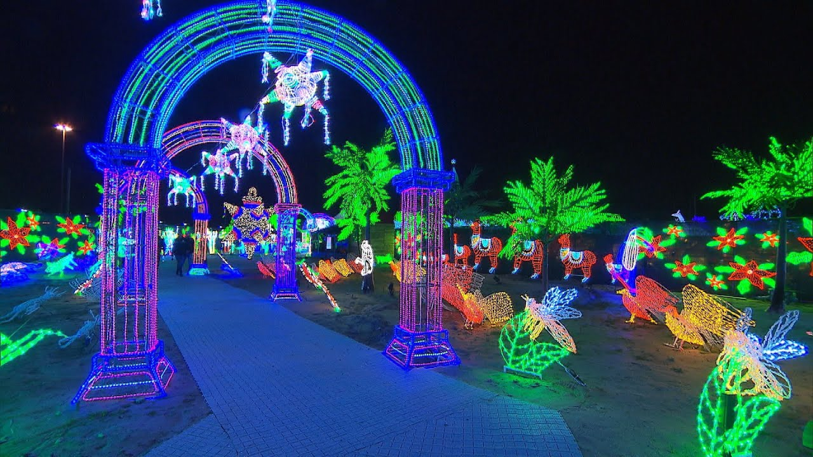

# Maxime Rocheleau

## **Intérêts dans le multimédia**
J'apprécie les oeuvres immersives dans le style comme le fait ILLUMI et les musées interactifs. J'aime également les jeux vidéos et la réalitée virtuelle.
J'ai une préférence pour les oeuvres qui sont grosses et impressionantes à voir ainsi que ceux qui sont colorées et illuminées.

Voici un exemple:
<https://www.youtube.com/watch?v=Lo9G2_nmnjE>

**ou**
En cliquant sur l'image:

## Ce qui me plait dans l'introduction à la muséologie en TIM
Découvrir les différentes oeuvres uniques et intéressantes qui font partie du cours. J'aime en apprendre d'avantage sur ces oeuvres.
